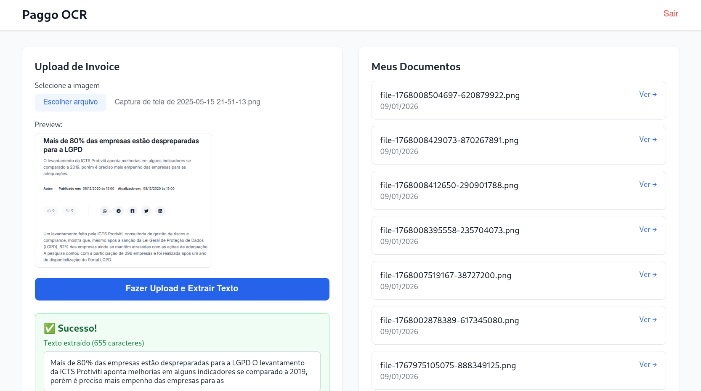
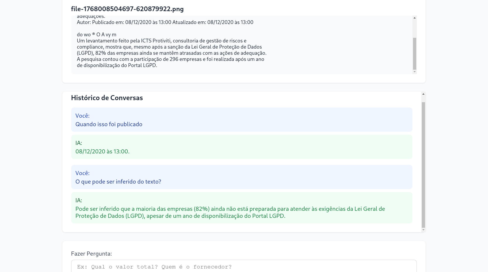

# Jornada de Desenvolvimento - Paggo OCR Case

## 🎯 Contexto Inicial

**Data de início:** 06/01/2025, 21:00h  
**Prazo:** 09/01/2025 (3 dias)  
**Meu nível:** Frontend (React, JS) - Primeira vez com backend

## Recursos Utilizados

**Sistema:**
- SO: Arch Linux
- Editor: VSCodium
- Node: v25.2.1
- npm: 11.7.0

### Desafio Reconhecido
O case pede NestJS, tecnologia que nunca usei, sequer sei backend, confesso que isso é amedontrador, mas aceito o desafio e fiquei interessado, afinal sempre quis aprender backend e esse desafio me instigou. Porém, eu obviamente não vou conseguir resolver o case todo dado o nível de dificuldade. Minha estratégia é definir um MVP e entregar tudo que for mínimo e funcional o mais simplificado possível. 

Devido ao meu nível de experiência (júnior/estagiário), fiz as seguintes escolhas técnicas priorizando funcionalidade e aprendizado:
1. **Backend**: Pensei muito aqui em usar o Next.js API Routes ao invés de NestJS separado, mas decidi ficar com NestJS porque realmente parece ser requisito obrigatório do projeto. Vai ser complicado? Sim, mas estou disposto ao desafio. Vou pesquisar sobre esse framework e aprender backend do zero.
2. **Banco de Dados**: SQLite, pois é fácil e rápido de implementar. O banco de dados não importa muito porque vamos usar o Prisma ORM que vai basicamente permitir que a gente escreva BD em Javascript, o que é bizarramente incrível
3. **Autenticação**: Sistema básico email/senha sem o OAuth. Sei que esse é um dos requisitos do case, mas não acho que vou conseguir implementar essa feature de segurança. Posso tentar, mas não acho que esse critério seja "crítico" para o meu MVP. Dentre os objetivos além do MVP, esse é o mais importante (tentarei assim que tiver tudo funcionando do MVP)
4. **OCR**: Tesseract.js (client-side). Já trabalhei com ele, é fácil e simples.
### MVP Definido

**1. Tela de Login (simplificada)**

- Email e senha
- Validação básica
- Salvar "sessão" no localStorage

**2. Tela de Upload**

- Selecionar imagem
- Preview da imagem
- Botão de upload com loading
- Mensagens de sucesso/erro

**3. OCR Funcionando**

- Processar imagem com Tesseract.js
- Mostrar texto extraído na tela
- Salvar resultado (localStorage ou banco simples)

**4. Chat com IA**

- Campo para fazer perguntas sobre o texto extraído
- Integração com Claude API
- Mostrar histórico de perguntas/respostas

**5. Ver Documentos Anteriores**

- Lista simples dos uploads feitos
- Clicar e ver o texto extraído
- Voltar para o chat sobre aquele documento
### Panorama Geral
Ao olhar os outros requisitos do case, o que mais me chamou atenção foi o uso de LLM, essa aplicação realmente cativou meu interesse porque eu realmente gosto de trabalhar com LLMs e recentemente trabalhei com um RAG que usava justamente OCR (no caso Tesseract.js), acho que pegar esse case pode ser um grande aprendizado, apesar de eu não dominar nada de backend, vou aceitar o desafio, apesar de que a dificuldade desse case ser claramente de júnior/pleno iniciante.

Pedi ajuda a um amigo meu que é Dev pleno, ele é muito ocupado e respondeu de forma vaga que eu deveria usar o Claude AI para auxiliar o desenvolvimento.

---

## 📚 Dia 1 - Terça, 06/01/2025

### 18:00h - Análise e Planejamento

**Primeira ação:** Seguindo o conselho desse amigo meu, pedi ajuda ao Claude AI para entender como funcionaria a arquitetura geral do projeto e, principalmente, a me ajudar a entender os conceitos fundamentais de backend (Controladores, módulos e serviços). Estou me sentindo confiante mesmo sem nunca ter visto backend na vida, até agora estou gostando.


**Recursos consultados:**
- Documentação oficial NestJS: https://docs.nestjs.com
- Claude AI para explicações conceituais
- Vídeos: https://youtu.be/0M8AYU_hPas?si=lylM5qH6GsDqS0kf / https://youtu.be/vZp2e5Rr1w0?si=DRV73-4z874vqpMv

**Observações:** Segundo a documentação, o NestJS foi fortemente inspirado em bibliotecas como Angular, React e Vue, isso explica sua semelhança principalmente ao Angular. Ao que me parece, NestJS é basicamente um Angular para backend, é tudo muito parecido. O primeiro vídeo me fez ter essa visão também, o segundo vídeo me fez destravar e realmente pegar o feeling do NestJS. Ao que parece, esse framework facilita e muito o trabalho do backend (que eu não sei o quão difícil é porque eu nunca mexi com back). Temos os decorators igual no Angular, os imports e exports de classes iguais do React, é tudo muito "mastigado". 

**Decisão técnica:** Como já disse, vou focar no MVP:
- Upload de imagem ✅
- OCR (Tesseract.js) ✅
- Chat com IA (Claude API) ✅
- Prisma + SQLite ✅
- Deixar auth para o final ⚠️ (Tomara que dê tempo)

### 21:15h - Setup Inicial

**Problema encontrado:** Permissões no Arch Linux
```bash
npm i -g @nestjs/cli
# Error: EACCES: permission denied
```

**Solução:** Usar `sudo`
```bash
sudo npm i -g @nestjs/cli
# ✅ Funcionou!
```

**Aprendizado:** No Linux, pacotes globais precisam de sudo. (coisa boba, mas precisa prestar atenção)

### 21:30h - Criando Projeto NestJS
```bash
cd backend
nest new . --skip-git
npm run start:dev
```

**Primeira impressão:** 
Ver "Hello World" pela primeira vez mexendo numa nova tecnologia é sempre gratificante, o npm nestjs criou um código base com vários arquivos de backend já pré feitos, típico de um framework, o React é assim, o Angular e por aí vai.

### 22:00h - Entendendo a Estrutura
```
src/
├── app.controller.ts  # "Garçom" - recebe requisições
├── app.service.ts     # "Cozinha" - processa lógica
├── app.module.ts      # "Cardápio" - registra tudo
└── main.ts            # Inicia o servidor
```

**Analogia que me ajudou:** Restaurante
- Controller = Garçom (recebe pedidos)
- Service = Cozinha (prepara comida)
- Module = Gerente (organiza tudo)

### 22:15h - Criando Módulo Document
```bash
nest g module document
nest g controller document
nest g service document
```

**Descoberta:** NestJS cria arquivos automaticamente e já registra no app.module

**Código implementado:**

`document.service.ts`:
```typescript
processarUpload(data: any) {
  return {
    success: true,
    message: 'Upload recebido',
    data: {
      filename: data.filename || 'unknown',
      timestamp: new Date().toISOString(),
    }
  };
}
```

`document.controller.ts`:
```typescript
@Controller('document')
export class DocumentController {
  constructor(private documentService: DocumentService) {}
  
  @Post('upload')
  uploadDocumentos(@Body() body: any) {
    return this.documentService.processarUpload(body);
  }
}
```

### 22:30h - Primeiro Bug 

**Problema:** curl retornando 404
```bash
curl http://localhost:3000/document/list
# 404 Not Found
```

**Debug realizado:**
1. ✅ Código escrito corretamente
2. ✅ Imports corretos
3. ❓ Por que não funciona?

**Solução encontrada:** Hot reload do servidor não atualizou! Bastou eu fechar e abrir o server de novo (Novamente coisa boba)
```bash
# Ctrl+C no servidor
npm run start:dev
# Agora funcionou! ✅
```

**Aprendizado:** Às vezes precisa reiniciar o servidor manualmente.

### 22:45h - Endpoints Funcionando


### 23:00h - Configurando Prisma

**O que é Prisma?** (aprendi hoje)
- ORM = Não precisa escrever SQL
- Escreve em JavaScript/TypeScript
- Autocomplete no editor
```bash
npm install @prisma/client
npm install -D prisma
npx prisma init --datasource-provider sqlite
```
![[Pasted image 20260107001543.png]](docs/screenshots/3.png)

**Schema criado:**
```prisma
model Document {
  id            Int      @id @default(autoincrement())
  filename      String
  extractedText String?
  createdAt     DateTime @default(now())
  chats         Chat[]
}

model Chat {
  id         Int      @id @default(autoincrement())
  documentId Int
  question   String
  answer     String
  document   Document @relation(fields: [documentId], references: [id])
}
```

**Verificar o modelo no studio:** 
```bash
npx prisma migrate dev --name init
npx prisma studio
```

![[Pasted image 20260107001642.png]](docs/screenshots/4.png)

**Reação:** Cara, isso aqui é muito mais legal que phpMyAdmin!
Lembrou minha aula de Banco de Dados do semestre passado, mas moderno! Até mesmo a linha de relação das tabelas ele mostra, muito daora.

###  Planos para amanhã
1. Conectar endpoints ao banco Prisma
2. Implementar upload de arquivos (Multer)
3. Integrar Tesseract.js
4. Começar Claude API

### Comandos Importantes
```bash
# NestJS
nest new projeto          # Criar projeto
nest g module nome        # Gerar módulo
nest g controller nome    # Gerar controller
nest g service nome       # Gerar service

# Prisma
npx prisma init           # Inicializar
npx prisma migrate dev    # Criar migration
npx prisma generate       # Gerar client
npx prisma studio         # Abrir UI
```

---

## 📚 Dia 2 - Quarta, 07/01/2025 

### 10:00h - Planejamento 
Comecei recapitulando esse meu diário para lembrar exatamente o que fiz ontem. No caso, fiz endpoints mock (que retornam dados fakes). O prisma também foi instalado, mas não está conectado a nenhum endpoint.

Hoje vou fazer os endpoints salvarem e buscarem de verdade no banco, adicionar upload de arquivos, depois OCR e uma LLM que ainda não decidi qual usar. Hoje tem bastante coisa para fazer e tecnologia para estudar.

https://www.youtube.com/live/TRa55WbWnvQ?si=kX6-NHIq1QvMGyRA
https://youtu.be/IdsBwplQAMw?si=asBXURjqrOVQua0H

Esses dois vídeos estão me ajudando a entender melhor os conceitos de backend para eu aprender a construir esses novos endpoints. Vou pesquisar e estudar mais antes de começar.

### 14:00h - Ação
O que vou fazer é o seguinte: Criar o PrismaService, que será uma classe que vai conectar ao banco de dados e vou criar métodos para acessar as tabelas, depois eu partirei para as outras tarefas que eu ainda precisarei estudar a tecnologia antes.

### 15:00h | Debug Intenso: Prisma v7 vs v5

**Problema encontrado:**
Após configurar Prisma, servidor não subia com erro:
```
error TS2610: 'document' is defined as an accessor in class 'PrismaClient'
```

**Diagnóstico:**
- Prisma v7.x tem bug conhecido com TypeScript (Pesquisei bastante para descobrir, mas perdi o link da thread do stack overflow)
- Conflito com propriedade `document` do schema
- Provider do schema do prisma estava errado: `prisma-client` ao invés de `prisma-client-js`

**Solução aplicada:**
1. Downgrade para Prisma v5.22.0 (versão estável)
```bash
npm uninstall prisma @prisma/client
npm install prisma@5.22.0 @prisma/client@5.22.0 --save-exact
```

2. Corrigir `schema.prisma`:
![[Pasted image 20260107154244.png]](docs/screenshots/5.png)

3. Regenerar Client:
```bash
npx prisma generate
npx prisma migrate dev --name init
```

**Segundo problema: VSCodium Cache**
- Arquivo no disco tinha `document: any;` na linha 6
- VSCodium mostrava versão diferente, daí fiquei muito tempo achando que o terminal estava louco
- Solução: Fechar e reabrir arquivo corrigiu o esse problema de cache do vscodium, só fui ver que realmente tinha essa linha ao fazer um cat no terminal, porque se fosse depender do vscodium eu estava lascado.

**Aprendizados:**
- Prisma v7 ainda instável (lançado recentemente), tomar cuidado com tecnologias com versões recentes.
- VSCodium pode ter cache desatualizado - sempre verificar `cat` no terminal
- `npx prisma generate` é necessário após cada mudança no schema

### 15:30h | ✅ Backend Base Funcionando!

**Status:** Servidor rodando com sucesso!
![[Pasted image 20260107154550.png]](docs/screenshots/6.png)
**Rotas disponíveis:**
- ✅ POST /document/upload - Salva documento no banco
- ✅ GET /document/list - Lista todos documentos
- ✅ GET /document/:id - Busca documento específico

**Testes realizados:**
![[Pasted image 20260107154623.png]](docs/screenshots/7.png)

**Verificação no banco:**
```bash
npx prisma studio
```
✅ Registros visíveis no Prisma Studio
![[Pasted image 20260107154646.png]](docs/screenshots/8.png)
**Tempo gasto hoje:** ~2h (setup + debug)
**Tempo perdido em debug:** ~1h30min 

### 15:30h | Próximo Passo: Upload Real de Arquivos

**Objetivo:** Fazer endpoint aceitar arquivos de imagem (não só JSON)

**Tecnologia:** Multer (middleware de upload do NestJS)

**Observações:** Tenho que estudar essa tecnologia, vou ter que me aprofundar mais um pouco no NestJS antes de continuar.

**Progresso do dia:**
Espero ainda hoje terminar pelo menos o OCR e talvez a LLM API, pois eu quero mesmo que nos próximos dias dê para terminar o MVP e fazer o OAuth porque dei uma olhada por alto nessa tecnologia e achei muito bacana, apesar de meio confusa, principalmente o lance de chaves de autenticação.

### O que temos até agora?
![[Pasted image 20260107160954.png]](docs/screenshots/9.png)
O service do prisma está assim, o decorator injetável é para seer usado em qualquer lugar. O extends do PrismaClient é para herdar as funcionalidades do prisma (coisa básica de POO) para eu ter acesso aos métodos do cliente como document.create e document.findMany. Implements é para que, assim que essa classe for criada vai criar esse método auxiliar que eu nomeei criativamente como "onModuleInit" cuja única função é um async/await para conectar ao banco esperando antes de conectar, ou seja, isso é uma forma de garantir que o app inicie sempre antes conectado ao banco para evitar problema.

![[Pasted image 20260107161515.png]](docs/screenshots/10.png)
No prisma module tem esse decorator global para ficar evitando de importar isso em todo lugar.
![[Pasted image 20260107161730.png]](docs/screenshots/11.png)
Em document service modifiquei esses métodos e os tornei async porque ela demora para acessar, aprendi que o par async/await é muito importante no back para poder garantir que as promisses (que pegamos lá no frontend) não sejam vazias, achei isso muito bacana.
### 15:50h - Upload de arquivos
https://youtu.be/XMxKUONCQh8?si=cwOAl7opHn2Wv_-W
Esse vídeo foi muito útil para eu aprender como usar o multer, a instalação correu tranquila, só segui a documentação. Agora tá na hora de implementar isso no código e ver qual que é.

Ok, ainda não entendi. Então tive que ver esse [vídeo](https://youtu.be/HKF9i9In0AI?si=aAWoTwA8HxZuz7k9) aqui em espanhol para entender como modular o código corretamente. 

Primeiro, deixa eu definir o que aprendi pesquisando a respeito:

**O que é Multer?** - Middleware do Express para processar `multipart/form-data` (uploads) - Gerencia onde e como salvar arquivos - Permite validações (tipo, tamanho) 
#### Estrutura Criada 
```bash mkdir uploads/ # Pasta para armazenar arquivos mkdir src/config/ # Configurações do projeto echo "uploads/" >> .gitignore # Não versionar uploads ``` 
#### Configuração do Multer
(`src/config/multer.config.ts`) 
Criei arquivo de configuração com:
**1. Storage (onde/como salvar):**
![[Pasted image 20260107170329.png]](docs/screenshots/12.png)
**Por que nome único?** - Evita sobrescrever arquivos - Facilita rastreamento - Previne conflitos de nome 
**2. FileFilter (validação):** ```typescript fileFilter: (req, file, callback) => { if (!file.mimetype.match(/\/(jpg|jpeg|png|gif)$/)) { return callback(new Error('Apenas imagens!'), false); } callback(null, true); } ``` 
Valida MIME type antes de salvar (segurança) 
**3. Limits (tamanho máximo):** ```typescript limits: { fileSize: 5 * 1024 * 1024 // 5MB } ``` 
**Nota:** Para fazer essa validação eu passei um leve perrengue na sintaxe, daí eu recorri ao Claude que me ajudou a corrigir.
#### Modificações no Controller
![[Pasted image 20260107170449.png]](docs/screenshots/13.png)
**O que mudou:** 
- `@UseInterceptors(FileInterceptor('file', multerConfig))` → Ativa Multer 
- `'file'` = nome do campo no form-data - `multerConfig` = nossas configurações 
- `@UploadedFile()` → Decorator que extrai o arquivo processado 
- `file: Express.Multer.File` → Objeto com metadados: 
	- `filename` - nome gerado 
	- `originalname` - nome original 
	- `path` - caminho no disco 
	- `size` - tamanho em bytes 
	- `mimetype` - tipo (image/jpeg, etc)

 
#### Como funciona?
1. Cliente faz POST com multipart/form-data
2. Multer intercepta a requisição  
3. Valida tipo (apenas imagens) 
4. Salva arquivo em ./uploads/ com nome único 
5. Passa objeto `file` pro Controller 
6. Controller passa pro Service 
7. Service salva metadados no banco 
8. Retorna JSON com informações do upload
![[Pasted image 20260107171008.png]](docs/screenshots/14.png)

**Status:** ✅ Upload de arquivos 100% funcional! 

**Próximo passo:** Integrar Tesseract.js para extrair texto (OCR)

---

### 17:00h - Teste do OCR

Aqui finalmente vou implementar algo que não estou aprendendo do zero. Eu já mexi com Tessecact no python para fazer um RAG System, então isso deve ser moleza de adaptar para o JS (Só muda sintaxe basicamente)

![[Pasted image 20260107180850.png]](docs/screenshots/15.png)
O serviço ficou assim, sem muito segredo e mistério para mim, basicamente uma tradução para JavaScript daquilo que fazia em Python. No caso coloquei uns logs para depuração, mas provável que vá comentar essas linhas agora que já sei que está funcionando.

![[Pasted image 20260107181028.png]](docs/screenshots/16.png)

Imagem que eu usei para testar: 
![[a.png]](docs/screenshots/a.png)

Ele só não conseguiu pegar o top text ali "Universidade Federal do Rio de Janeiro", meu palpite é que seja por causa do contraste da cor azul no verde (cores escuras). Como eu resolveria isso? Da mesma forma que resolvi lá no meu projeto de RAG System do Python: converter a imagem para preto e branco para aumentar o contraste e facilitar a leitura, mas sinceramente eu acho que para o caso de uso (notas fiscais e invoice) não terá problema. De qualquer modo eu vou deixar anotado aqui caso sobre tempo eu vá fazer essa melhoria, mas agora preciso partir para a API da LLM logo para amanhã eu finalizar e integrar tudo no front, pois no caso do front para mim é tranquilo, o problema seria ter que ver essa nova tecnologia do OAuth que nunca mexi (Só vi por alto).

---
### 20:00h - Implementação da LLM
Eu dei uma parada para descansar e fazer outras coisas, agora voltei e vou finalizar o dia implementando a LLM e suas funcionalidades interativas com o backend. Não tem muito segredo aqui também, eu já trabalhei com IA antes e ainda trabalho atualmente. 

**Escolha do LLM**: Estive pensando entre Mistral e Claude. O bom da Mistral é que já usei ela no meu projeto de RAG, porém, eu a usei localmente, nunca via API. Acredito que o Claude seja melhor nesse caso.

Criei minha API key gratuita na anthropic e coloquei  no .env do projeto. Depois disso criei o módulo e serviço do chat.

Para codar o serviço, eu dei uma travada e não estava conseguindo tratar um erro na propriedade .text porque ela só podia ser usada em ThinkingBlock e ContentBlock, eu procurei e procurei soluções para esse erro e não achava, daí joguei no próprio Claude e felizmente ele corrigiu para mim:
![[Pasted image 20260107204912.png]](docs/screenshots/17.png)
Eu tinha feito uns erros de sintaxe, mas acontece... Meio frustrante, mas acontece, ao menos estou aprendendo bem rápido esse negócio de backend (Dominei a lógica já).

A função principal de chat.service.ts é a fazerPergunta, mas eu criei uma função extra com uma funcionalidade bem parecida com a funcionalidade que usava no meu RAG (para resumir livros e PDFs)
![[Pasted image 20260107205323.png]](docs/screenshots/18.png)
Até mesmo o prompt é igual a esse meu projeto RAG que eu fiz usando a Mistral no meu ambiente local, acho que isso pode ser interessante.

### 21:00h - Toques finais
Eu senti que estava faltando uma forma de tratar as requisições da API, então temo que terei de criar um controller para esse caso.

Ok, após terminar de colocar tudo nos módulos e terminar o controller (integrar com o prisma também) eu testei e parece que eu esqueci um detalhe bem pequeno: A API Key do Claude não tem mais aquele teste grátis que tinha uns meses atrás.

![[Pasted image 20260107210726.png]](docs/screenshots/19.png)

Vou ter que substituir...

### 21:20h - FINALMENTE
Depois de um tempo fuçando por aí eu encontrei o groq, que disponibiliza API key gratuita e ainda pode usar vários modelos diferentes.
![[Pasted image 20260107212511.png]](docs/screenshots/20.png)
Tive que fazer umas mudanças no chat.service, até tive que tirar aquela função de Type chart. Agora eu coloquei para funcionar:
![[Pasted image 20260107212826.png]](docs/screenshots/21.png)

Fiz duas requisições, a primeira perguntei qual o nome do professor da imagem de id4 que está lá no banco e ainda depois fiz uma requisição do histórico.

![[Pasted image 20260107213008.png]](docs/screenshots/22.png)
Depois fiz essa outra pergunta e ele não soube responder, claro, o OCR não está enxergando "Universidade Federal do Rio de Janeiro" como eu disse anteriormente, posso facilmente resolver esse problema como eu disse, mas isso vou deixar para depois porque hoje já fiz demais. Estou muito satisfeito de ter terminado de fazer o backend 100% hoje. 

Amanhã farei o frontend e farei a integração e, se der tempo, farei uma autenticação legal com o OAuth (ainda não sei se será no Next ou Nest)

Vou commitar tudo que eu fiz e dar um push. Eu notei agora que, a cada checkpoint que fiz aqui eu deveria ter commitado, assim ficaria mais fácil de ver o progresso passo a passo, isso é boa prática, mas enfim, vou passar a fazer isso a partir de amanhã.

---
## 📚 Dia 3 - Quinta, 08/01/2025 

Hoje eu não pude codar nada e tive que resolver outras questões para poder voltar ao pc e continuar o case. Nesse tempo de ociosidade, eu aproveitei para estudar as tecnologias para fazer esse Auth. De início pensei em algo basicão feito no próprio frontend, um login fake, algo bem básico de crud mesmo como já estou acostumado, mas imaginei que ficaria ruim e então resolvi fazer algo mais elaborado: vou fazer no backend através do JWT. De longe o vídeo que mais me ajudou foi esse: https://youtu.be/EFDUvzJT_wI?si=7h2rga9Fh8Ak1tV9
agora aprendi os conceitos de rotas privadas e como protegê-las. Ainda assim, sinto que será desafiador implementar o auth.


## 📚 Dia 4 - Sexta, 09/01/2025


### 12:00h - Terminei o Auth
Comecei bem cedo 8h em ponto, tive muitas confusões na hora de implementar as mudanças estruturais no controlador e serviço de documentos. No campo de criar o document eu tive que fazer uma leve modificação na função de processar upload, no caso o que ela retorna:

![[Pasted image 20260109125212.png]](docs/screenshots/23.png)

Eu tive que colocar o campo de user com a cláusula connect para pegar o token, porque eu precisei mudar o prisma e do banco de dados de forma geral, 
adicionando uma nova tabela com o usuário e seus dados de autenticação.

![[Pasted image 20260109125609.png]](docs/screenshots/24.png)

Como a tabela user possui relação  1 para n (1 único usuário pode upar vários docs), tive de criar uma chave estrangeira para relacionar as tabelas. O mais importante para o problema que estava enfrentando é justamente esse novo campo UserId que é a chave estrangeira da tabela User. O que eu esstava falhando era em configurar o controlador corretamente com o novo decorator de autenticação e também ajustar os parâmetros da função de upload (Não só o multer para a imagem, mas agora para fazer upload precisa do usuário também, esse é nosso caso de uso)

![[Pasted image 20260109130033.png]](docs/screenshots/25.png)

E por fim, o ajuste no controlador, na rota de document/upload

![[Pasted image 20260109130224.png]](docs/screenshots/26.png)
Por fim, fiz um bocado de teste para ver se estava tudo ok:

![[Pasted image 20260109130536.png]](docs/screenshots/27.png)
Registro.

![[Pasted image 20260109130733.png]](docs/screenshots/28.png)

Fiz uploads, token gerado, tudo normal

![[Pasted image 20260109130823.png]](docs/screenshots/29.png)
Tentei fazer upload sem token e não funcionou.

![[Pasted image 20260109130924.png]](docs/screenshots/30.png)

Olhando no banco dá para ver que os users são distintos e separados pelos seus respectivos docs upados.

### 15:00h até 21:00h - Terminei o front e conectei ao back
Comecei fazendo o front básico em next.js, sem mistério, eu já manjo razoavelmente bem de react então foi bem tranquilo fazer o front. Dessa vez, fora de costume eu fiz sem usar axios, mas sim Fetch API. Usei useState do react e modulei igualzinho. Para armazenar o token da sessão vou usar localStorage para não ficar chato de ficar fazendo login toda hora.

Sobre o CSS, de início pensei em fazer a estilização na própria div, mas isso seria bem feio e grosseiro, então mudei e separei o css em módulos bonitinho. Resolvi também usar o tailwind para deixar mais bonitinhho. 


Eu geralmente gosto de fazer o frontend me baseando numa tela pré existente do figma, pois é assim que costumo trabalhar. Nesse caso tomei a liberdade para fazer algo genérico mesmo, o tailwind ajuda nisso. 


As telas ficaram mais básicas do que eu gostaria, mas o importante é que o back funciona, pelo incrível que pareça foi só configuras o CORS e tudo já funcionou de primeira. Só tive que ajustar o caminho das rotas do front com o do back porque eu sempre errava. 



Para testar, vou upar um arquivo preto e branco para similar o mais próximo possível o caso de uso.



Pelos meus testes, imagens coloridas e com textos de tamanhos muito distorcidos causam problema no ocr, isso é um ponto a se melhorar, mas para um mvp ele está bem decente, estou satisfeito e irei fazer o deploy.
